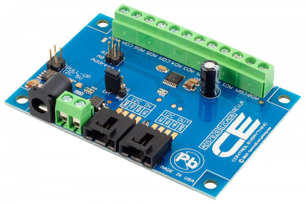

[](https://store.ncd.io/product/ads7828-analog-to-digital-converter-8-channel-12-bit-with-i2c-interface/).

# ADS7828

The I2CAD8 is a single-supply low-power 12-bit data acquisition device that features a serial I2C interface and an 8-channel multiplexer. The I2CAD8 is controller has an integrated I2C Input and Output port as well as screw terminal connectors for each analog input channel.
This Device is available from www.ncd.io

[SKU: ADS7828]

(https://store.ncd.io/product/ads7828-analog-to-digital-converter-8-channel-12-bit-with-i2c-interface/)
This Sample code can be used with Raspberry Pi.

Hardware needed to interface ADS7828 12Bit ADC With Raspberry Pi :

1. <a href="https://store.ncd.io/product/ads7828-analog-to-digital-converter-8-channel-12-bit-with-i2c-interface/">ADS7828 12Bit 8-Channel ADC</a>

2. <a href="https://store.ncd.io/product/i2c-shield-for-raspberry-pi-3-pi2-with-outward-facing-i2c-port-terminates-over-hdmi-port/">Raspberry Pi I2C Shield</a>

3. <a href="https://store.ncd.io/product/i%C2%B2c-cable/">I2C Cable</a>

## Python

Download and install smbus library on Raspberry pi. Steps to install smbus are provided at:

https://pypi.python.org/pypi/smbus-cffi/0.5.1

Download (or git pull) the code in pi. Run the program.

```cpp
$> python ADS7828.py
```
The lib is a sample library, you will need to calibrate the sensor according to your application requirement.
